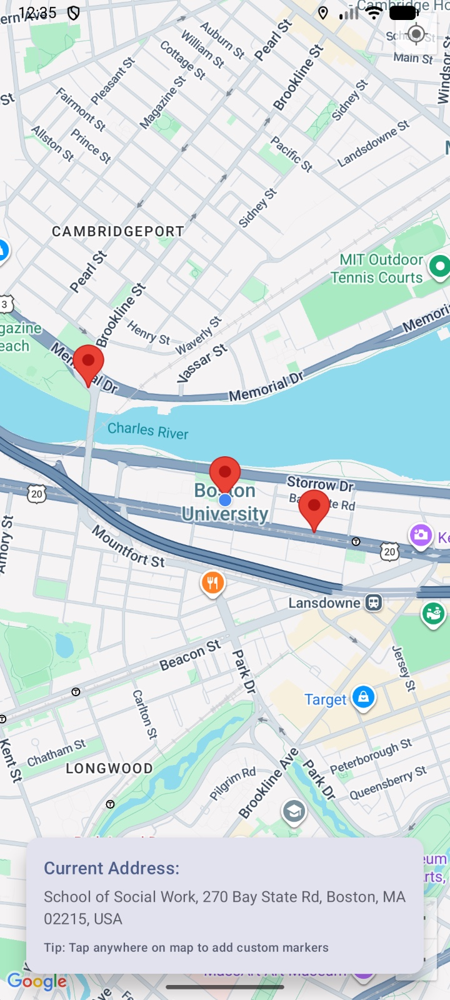

# AshishAssignment4_Q2

# Location Information App (Android - Jetpack Compose)

This Android app shows the user's current location on **Google Maps** and displays the address information.  
It also allows the user to tap on the map and place custom markers.

---

## Features

- Requests **location permission**
- Displays **Google Map**
- Centers map on the **user's current location**
- Adds a **marker** at the current location
- Shows the **current address**
- Lets the user **tap anywhere on the map to place custom markers**

---

## Screenshot

---

## Technologies Used

- **Kotlin**
- **Jetpack Compose**
- **Google Maps Compose**
- **Fused Location Provider**
- **Geocoder**
- **Accompanist Permissions**

---

## Main Files

- `AndroidManifest.xml` → permissions and Google Maps API setup
- `MainActivity.kt` → permission handling, Google Map UI, current location, address display, custom markers

---

## How It Works

- The app first asks for **location permission**
- After permission is granted, it gets the user's current location
- The map camera moves to that location
- A marker is added for the current location
- The app uses **Geocoder** to convert latitude and longitude into a readable address
- When the user taps on the map, a new custom marker is added

---

## How to Run

1. Open the project in **Android Studio**
2. Add your **Google Maps API key**
3. Run the app on an emulator or real device
4. Allow location permission when prompted
5. Tap anywhere on the map to place custom markers

---

## Notes

- Internet is required for Google Maps and address lookup
- Location services should be enabled on the device
- Best results come from testing on a real device, but emulator also works

---

## AI Usage

I used AI tools (ChatGPT) to help fix some issues related to:
- XML configuration errors
- Google Maps API key setup
- General debugging and small fixes
- README formatting

The main app logic, implementation, and design are my own work.

---

## Author

Ashish Joshi  
Boston University
